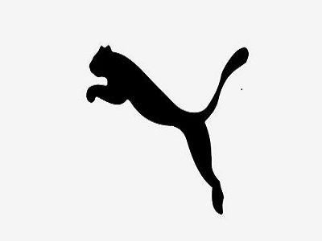
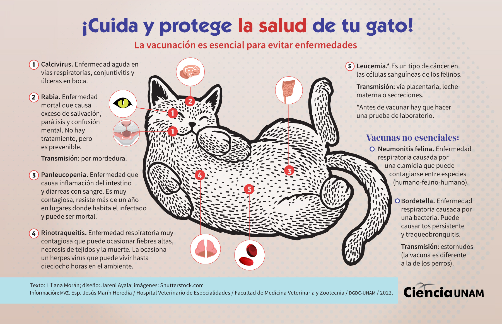

### Lista de fuentes y referencias

1. https://www.thefilmintimes.com/es/ Identidad visual de la página 
2. Logo de Puma (explicado en la presentación)
 
3. https://www.britannica.com/animal/native-cat
4. 
5. 

