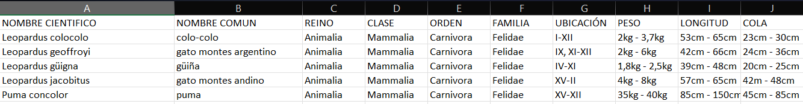

- En primera instancia, se buscaba crear una visualización atómica que permitiese responder ¿A qué clase y familia corresponde cada gato? ¿Son mamiferos? ¿En qué región se encuentran? ¿Cuáles son sus caracteristicas fisicas? ¿Cuánto mide su cola? ¿Cuánto pesan? ¿Cuánto miden?

- Con las preguntas seleccionadas y la historia definida, buscamos una visualización que permitiese entender de forma fácil y simple las caracteristicas de cada animal específicamente con las cualidadesde peso y longitud de cada uno. Para ello utilizamos un mapa simple de Pyplot, especificamente uno de dispersion que combinara eje X e Y. https://matplotlib.org/stable/tutorials/pyplot.html#introduction-to-pyplot 

Se intento, en primer lugar, trabajar con la base de datos que se trabajó en la entrega anterior, sin embargo esta al momento de intentar trabajarse tenía errores de formato y encabezados. Además, no contaba con datos cualitativos CUANTIFICABLES, o mejor conocidos como categoricos, sin embargo dentro de nuestra bibliográfica consideramos fichas de clásificación: 
- https://gatoandino.org/gato-andino/ 
- https://clasificacionespecies.mma.gob.cl/wp-content/uploads/2019/10/Leopardus_colocolo_P07.pdf 
- https://clasificacionespecies.mma.gob.cl/wp-content/uploads/2019/10/Leopardus_geoffroyi_P07.pdf
- https://clasificacionespecies.mma.gob.cl/wp-content/uploads/2019/10/Leopardus_guigna_P07.pdf 
- https://clasificacionespecies.mma.gob.cl/wp-content/uploads/2019/10/Puma_concolor_P07.pdf 

En cada ficha se especifican los datos trabajados: peso y longitud. Hay dos Scripts que permiten visualizar las variables utilizadas. 
Cabe destacar que se rescataron los datos filtrados de la base de datos anterior. Estos fueron traspasados a un excel y se le sumaron los datos extraidos de cada ficha de clásificación. 
Por lo tanto la base de datos cuenta con componentes cualitativos y cuantitativos, como a continuación podemos ver. 

 

El mayor desafio fue identificar como gráficar estos datos que son puramente cualitativos (clase, nombre cientifico, orden, etc) Por ende, nos fijamos en sus características fisicas para así acercar a la persona, con su imaginación y los datos, a un felino salvaje con el cual no tiene contacto. 

Determinamos variables con su definición especifica: 

DENOMINACIÓN1 = felidae["NOMBRE COMUN"]
PESO = felidae["PESO"]
LONGITUD = felidae["LONGITUD"]
COLA = felidae["COLA"]
DENOMINACIÓN2 = felidae["NOMBRE CIENTIFICO"]
CARNIVOROS = felidae["ORDEN"]
MAMIFERO = felidae["CLASE"]
UBICACIÓN = felidae["UBICACIÓN"]

Y fuimos formando el gráfico de dispersión con 4 de estos datos: Denominación 1, Peso, Longitud y Cola. Se determinó cada eje, el tamaño de la letra y la dispocisión de cada elemento (color, tamaño y formas para diferenciar,etc.). 

Es necesario destacar que quisimos aventurarnos con datos de la población. Cada ficha brinda esos datos, pero lamentablemente son aproximaciones poco rigurosas o muchas veces muy específicas. Por ejemplo, el puma cuenta con 32 felinos con collar para ser monitoreados en Torres del Paine, empero, el resto de la población a lo largo de Chile no es monitoreado. Solo se hace una aproximación de su densidad poblacional. 

